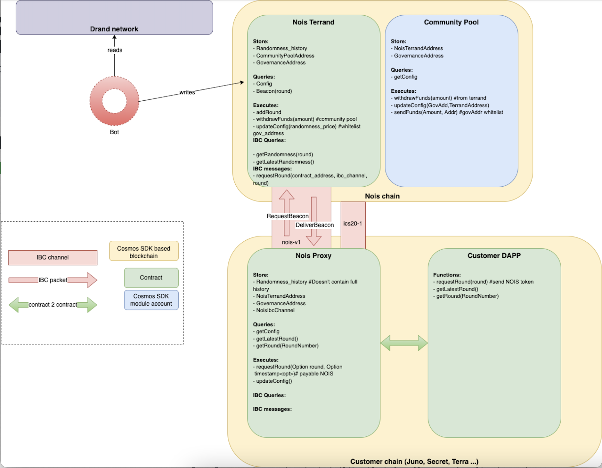

# Our Approach

Nois Network aims to provide a safe and secure solution native to the IBC world and to provide the best possible user experience for a wide range of applications.

In contrast to other consensus algorithms, Tendermint-based blockchains do not
need or provide randomness at block production layer. Therefore, for our first iteration,
we are building our stack entirely on the application level of the chain (i.e.
as a collection of smart contracts and offchain bots). This design decision
makes it really easy for developers to use our technology since randomness can
be consumed onchain only via the usage of a simple library.

In the first iteration, Nois will use random beacons produced by the [drand] network, which is powered by a consortium of participants that generate randomness using multi-party computation. Each randomness is associated with a round and is delivered periodically, i.e. there is a bijective mapping between the drand round and the wallclock time. The randomness is based on a BLS threshold signatures schema, which produces unpredictable values that cannot be manipulated by any of the drand participants. The drand mainnet is instantiated by the [Legue of Entropy][loe], which has been operating it in production for more than two years. For example, Filecoin relies on drand for block production and its storage proofs.

Drand random beacons can be submitted to blockchains that perform BLS signature verification. This way, we can build a random oracle that securely brings randomness on chain. This method was [described and proven in 2020 for CosmWasm](https://medium.com/@simonwarta/when-your-blockchain-needs-to-roll-the-dice-ed9da121f590).
A few months later, this proof of concept was turned into production by [Terrand](https://docs.terrand.dev/).
BLS verification is a computationally heavy operation, but leveraging the strength of the Rust optimizer and Wasm's near native execution speed, drand beacons could be verified for less than $3 in gas fees on Terra.

The next step in the evolution is to make drand beacons easily accessible by as many dapps as possible in a way that is easy to use and affordable. In an ideal world, a dapp developer would just do something like this:

```rust
// pseudo-code
let beacon: [u8; 32] = await getNextRandomness();

let [dice1, dice2] = ints_in_range(randomness, 1..=6);
let double_dice = dice1 + dice2;
```

We believe the burden of implementing drand verification once per contract or even once per blockchain is too much in an ecosystem that is preparing for thousands of independent and interconnected blockchains. Instead of executing the drand verification on the chain of the dapp, the Nois chain is acting as the randomness layer in the Cosmos ecosystem which is available via IBC.

## Architecture


Multiple actors are involved in the Nois system:

- Nois validators: these are the nodes that create and validate blocks on our
  chain. They are responsible for executing the transactions and run a consensus
  on the output.
- Nois bots are responsible for fetching the randomness from the drand network
  and submit it to the Nois Oracle contract that verifies it.
- Nois Oracle contract contains the logic to verify a drand randomness, but also
  to incentivize the Nois bots and is the recipient of any IBC messages made on
  other chains.
- Nois proxy contract lives on any end user chain (e.g. Juno, Stargaze, Osmosis) and is
  the main entry point for users to fetch randomness from.
- IBC relayers are responsible for relaying the randomness from the Nois Oracle
  contract to the Proxy contract.

## Workflow

The following steps are taken to get the randomness:

1. A contract on a CosmWasm-enabled chain sends a message to a Nois proxy contract on the same chain.
2. The proxy contract sends an IBC message to its counter-part on the Nois Network, where the job is put in the queue.
3. Once the drand beacon of the correct round is released, Nois bots send it to the Nois smart contract for verification, as a transaction.
4. After successful verification, the pending jobs for the round are processed. For every matching job, an IBC response with the beacon is sent, thanks to the IBC relayers.
5. The proxy contract receives the beacon and sends a callback to the original contract.

[drand]: https://drand.love
[loe]: https://en.wikipedia.org/wiki/League_of_entropy
